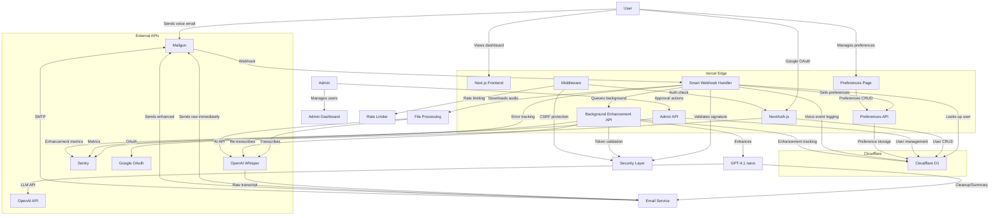
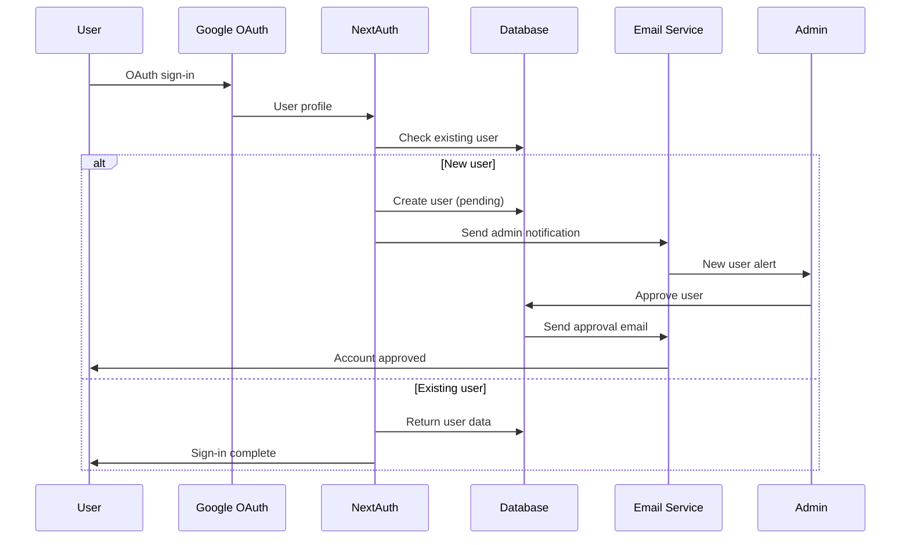
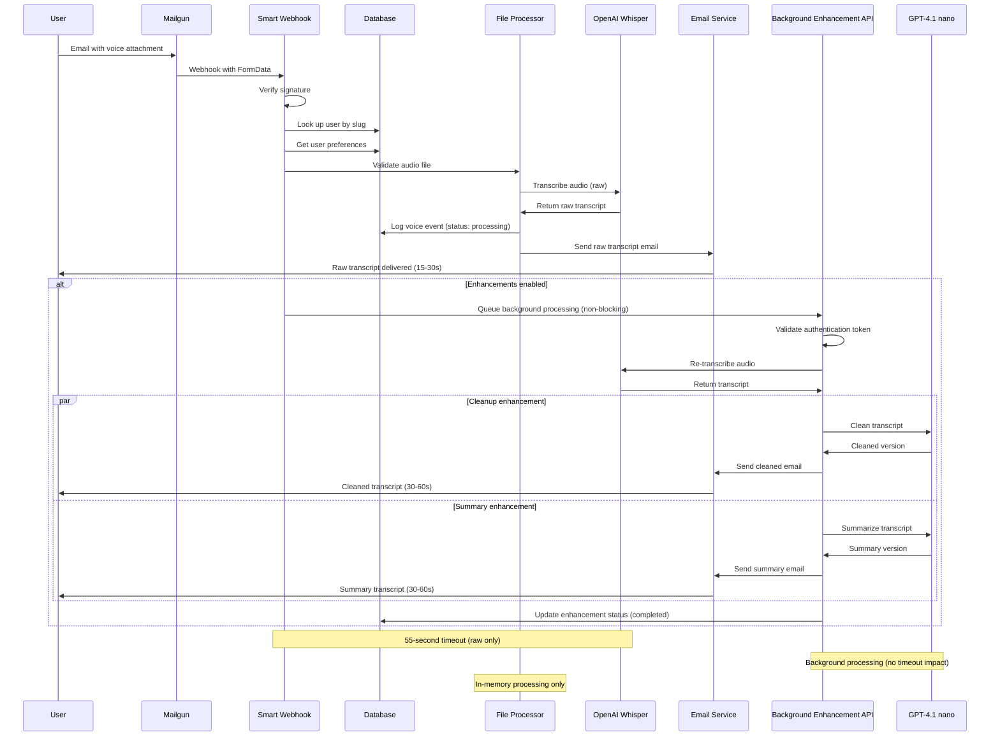

# WhatsApp Echo - Voice Note Transcription Service Architecture

**Revision Date:** July 5, 2025  
**Version:** 1.01  
**Status:** Production Ready with Background Processing

---

## 🔄 1.01 Update: Enhanced Email System & Markdown Rendering

**Release Date:** July 5, 2025

- **Beautiful HTML Email Templates for Enhancements**: All enhancement emails (cleaned, summary, quick summary) now use modern, styled HTML templates for a much better reading experience.
- **Markdown Rendering for Summaries**: Summaries and quick summaries are now delivered as formatted HTML, not plain text. Markdown is converted to HTML using the Showdown library.
- **Showdown Integration**: The Showdown library is used for robust markdown-to-HTML conversion in all enhancement emails, ensuring bullet points, headings, and formatting are preserved.
- **New Markdown Utility**: The new `src/lib/markdown.ts` utility provides secure, reusable markdown-to-HTML conversion for all enhancement emails.
- **Consistent Branding**: All enhancement emails now match the look and feel of other system emails.
- **Improved User Experience**: Enhanced emails are easier to read, with clear sections, bullet points, and action items.

---

## High-Level Overview

WhatsApp Echo is a production-ready voice note transcription service built with Next.js 14 that enables users to send audio files via email and receive AI-generated transcriptions with optional enhancements. The system uses a hybrid architecture combining Vercel's serverless platform for the web application with Cloudflare D1 for database services, OpenAI Whisper for transcription, and Mailgun for email processing. It features an innovative "Always Raw + Optional Enhancements" processing system with **background processing capabilities**, user preference management, comprehensive admin management, user approval workflows, and robust security measures optimized for the Vercel Hobby tier.

**Privacy-First Design**: The architecture prioritizes user privacy with zero transcript content logging, in-memory-only audio processing, and no persistent storage of voice data. All transcript content is delivered directly via email without being stored on servers, ensuring maximum privacy protection for sensitive voice communications.

**Background Processing Architecture**: The system now implements a secure background processing system that separates raw transcription (immediate delivery) from enhancement processing (background execution), preventing serverless function timeouts while maintaining the "always raw" guarantee.

## Component Inventory

### Frontend Components
- **Next.js 14 App Router Application** - React-based web interface with SSR
- **Admin Dashboard** - User management interface with statistics and bulk operations
- **User Dashboard** - Personal voice note history and usage instructions
- **User Preferences Page** - Interactive interface for managing enhancement preferences
- **Authentication Pages** - Google OAuth sign-in and error handling
- **UI Component Library** - shadcn/ui components with Tailwind CSS styling

### Backend Services
- **API Routes** - Next.js API routes for webhooks, admin operations, preferences, and auth
- **User Preferences API** - RESTful endpoints for managing enhancement preferences
- **Smart Webhook Handler** - Processes inbound emails with always-raw + optional enhancements
- **Background Enhancement API** - Secure background processing for GPT-4.1 nano enhancements
- **Authentication Service** - NextAuth.js with Google OAuth integration
- **Database Layer** - Cloudflare D1 operations via REST API with preference management
- **OpenAI Integration** - Whisper transcription + GPT-4.1 nano enhancement services
- **Multi-Email Service** - Mailgun SDK for sending raw transcripts and enhanced versions
- **Markdown Utility** - `src/lib/markdown.ts` provides secure, reusable markdown-to-HTML conversion for all enhancement emails, leveraging Showdown for robust formatting.

### Security & Middleware
- **Route Protection Middleware** - Authentication and authorization enforcement
- **Rate Limiting System** - In-memory rate limiting with configurable windows
- **Security Headers** - CSRF protection, XSS prevention, and content security
- **Input Validation** - File type, size, and format validation
- **Error Handling** - Comprehensive error categorization and user feedback
- **Background API Security** - Token-based authentication for background processing
- **reCAPTCHA Integration** - v2 protection for contact forms against automated abuse

### Infrastructure & Configuration
- **Vercel Deployment** - Serverless hosting with function optimizations
- **Cloudflare D1 Database** - SQLite-based serverless database
- **Environment Management** - Centralized configuration with validation
- **Monitoring & Logging** - Sentry integration for error tracking
- **Database Migration** - Wrangler CLI for schema management

## Interaction Map



## Runtime / Deployment View

### Vercel Serverless Functions
- **Edge Runtime**: Middleware for routing and authentication
- **Node.js Runtime**: API routes with 60-second timeout for webhook processing
- **Background Functions**: Separate serverless functions for enhancement processing
- **Static Generation**: Frontend pages with SSR for authenticated content
- **Regional Deployment**: Primary region `iad1` (US East)

### Database & Storage
- **Cloudflare D1**: SQLite database accessed via REST API
- **No File Storage**: Audio files processed in memory, not persisted
- **Session Storage**: JWT tokens managed by NextAuth.js
- **Status Tracking**: Enhanced voice_events table with processing status

### External Service Integration
- **Google OAuth**: Identity provider for authentication
- **Mailgun**: Email service for inbound webhooks and outbound notifications  
- **OpenAI Whisper**: AI transcription service with streaming support
- **Sentry**: Error monitoring and performance tracking

### Security Boundaries
- **TLS Termination**: Vercel Edge with automatic HTTPS
- **API Gateway**: Vercel's built-in request routing and rate limiting
- **CSRF Protection**: In-memory token validation
- **Input Sanitization**: File type and size validation before processing
- **Background API Security**: SHA256 token-based authentication

## Data Flow & Storage

### User Registration Flow


### Voice Processing Pipeline (Always Raw + Background Enhancements)


### Database Schema
```sql
-- Users table with approval workflow
CREATE TABLE users (
  id           TEXT PRIMARY KEY,          -- cuid() identifier  
  google_email TEXT UNIQUE NOT NULL,     -- Google OAuth email
  slug         TEXT UNIQUE NOT NULL,      -- 6-char email alias
  approved     INTEGER NOT NULL DEFAULT 0, -- 0=pending, 1=approved
  created_at   DATETIME DEFAULT CURRENT_TIMESTAMP
);

-- User preferences for enhancement options
CREATE TABLE user_preferences (
  user_id                   TEXT PRIMARY KEY,          -- Reference to users.id
  transcript_processing     TEXT DEFAULT 'raw',        -- Legacy: 'raw', 'cleanup', 'summary'
  send_cleaned_transcript   INTEGER DEFAULT 0,         -- 0=disabled, 1=enabled
  send_summary             INTEGER DEFAULT 0,         -- 0=disabled, 1=enabled
  created_at               DATETIME DEFAULT CURRENT_TIMESTAMP,
  updated_at               DATETIME DEFAULT CURRENT_TIMESTAMP,
  FOREIGN KEY(user_id) REFERENCES users(id)
);

-- Voice events metadata with enhancement tracking
CREATE TABLE voice_events (
  id                    TEXT PRIMARY KEY,          -- cuid() identifier
  user_id              TEXT NOT NULL,             -- Foreign key to users
  received_at          DATETIME DEFAULT CURRENT_TIMESTAMP,
  duration_sec         INTEGER,                   -- Audio duration
  bytes                INTEGER,                   -- File size
  status               TEXT DEFAULT 'pending',    -- 'pending', 'processing', 'completed', 'failed'
  processing_type      TEXT DEFAULT 'raw',        -- 'raw', 'cleanup', 'summary'
  completed_at         DATETIME,                  -- When processing completed
  error_message        TEXT,                      -- Error details if failed
  enhancements_requested TEXT,                    -- JSON array of requested enhancements
  FOREIGN KEY(user_id) REFERENCES users(id)
);
```

## Tech Stack Table

| Component | Language/Framework | Infrastructure/Tooling |
|-----------|-------------------|------------------------|
| **Frontend** | TypeScript, React 18, Next.js 14 | Vercel Edge, Tailwind CSS |
| **Backend API** | TypeScript, Next.js API Routes | Vercel Serverless Functions |
| **Background Processing** | TypeScript, Next.js API Routes | Separate Vercel Functions |
| **Database** | SQL, SQLite | Cloudflare D1 via REST API |
| **Authentication** | NextAuth.js v4 | Google OAuth 2.0 |
| **Email Processing** | Mailgun SDK | Mailgun API, Webhook validation |
| **AI Transcription** | OpenAI SDK | Whisper-1 model via REST API |
| **AI Enhancement** | OpenAI SDK | GPT-4.1 nano model for cleanup/summary |
| **User Preferences** | TypeScript, React State | RESTful API with form validation |
| **Background Processing** | Node.js, Promise-based | Secure token-based authentication |
| **UI Components** | shadcn/ui, Radix UI | Tailwind CSS, CSS Modules |
| **Security** | Custom middleware | CSRF tokens, Rate limiting, Background API tokens, reCAPTCHA v2 |
| **Monitoring** | Sentry SDK | Error tracking, Performance monitoring |
| **Development** | TypeScript 5.6, ESLint | Wrangler CLI, Vercel CLI |
| **Deployment** | Vercel Projects | GitHub integration, Environment variables |

## Operational Considerations

### Scaling & Performance
- **Horizontal Scaling**: Vercel's automatic scaling for serverless functions
- **Database Scaling**: Cloudflare D1 scales automatically with usage
- **Rate Limiting**: Per-user limits prevent abuse (5 voice notes/minute)
- **Timeout Optimization**: 55-second processing window with 5-second safety margin
- **Memory Optimization**: In-memory audio processing to avoid disk I/O
- **Background Processing**: Separate functions prevent timeout issues

### Resilience & Reliability  
- **Error Recovery**: Comprehensive error categorization with user-friendly messages
- **Circuit Breaker**: Graceful degradation when external services fail
- **Retry Logic**: Mailgun webhooks automatically retry failed requests
- **Fallback Authentication**: Development mode continues with database failures
- **Input Validation**: Multi-layer validation prevents malformed requests
- **Background Processing**: Independent enhancement processing with status tracking

### Observability
- **Structured Logging**: Detailed console logs with request tracing
- **Error Tracking**: Sentry integration with source maps and user context
- **Performance Monitoring**: Function execution time and memory usage
- **Rate Limit Metrics**: In-memory statistics for monitoring abuse
- **Processing Analytics**: Success rates and timeout tracking
- **Status Tracking**: Database-based enhancement progress monitoring

### Security Measures
- **Authentication**: Google OAuth with JWT session management
- **Authorization**: Role-based access control (admin vs user)
- **Input Sanitization**: File type, size, and content validation  
- **Rate Limiting**: Per-endpoint limits with exponential backoff
- **Security Headers**: CSP, HSTS, XSS protection, clickjacking prevention
- **CSRF Protection**: Token-based request validation
- **Background API Security**: SHA256 token-based authentication for background processing
- **Webhook Security**: HMAC signature verification for Mailgun (implementation pending)
- **reCAPTCHA v2**: Contact form protection against automated abuse and spam bots

### Privacy Protection
- **Zero Content Logging**: Transcript content is NEVER logged to console, files, or monitoring systems
- **Metadata-Only Logging**: Only technical metadata (file size, processing time, success/failure) is logged
- **In-Memory Processing**: Audio files are processed entirely in memory without disk writes
- **No Transcript Storage**: Voice transcripts are not stored in database - only delivered via email
- **Error Safety**: Error objects contain only technical metadata (length, processing type), never transcript content
- **Privacy-First Design**: System architecture prioritizes user privacy over debugging convenience
- **Monitoring Exclusion**: Sentry error reporting excludes all transcript content and sensitive user data

### Cost Optimization
- **Vercel Hobby Tier**: Optimized for free tier limits (60-second functions)
- **Cloudflare D1**: Pay-per-use SQLite with generous free tier
- **No File Storage**: In-memory processing eliminates storage costs
- **Efficient Database Queries**: Indexed lookups and pagination
- **OpenAI Usage**: Optimized audio format recommendations to reduce costs
- **Background Processing**: Efficient use of serverless function quotas

## Open Questions / Risks

### Technical Risks
- **Function Timeout**: Large audio files (>10MB) may exceed 60-second Vercel limit
- **Memory Constraints**: Processing very large files could hit memory limits
- **Database Limits**: Cloudflare D1 has query limits that could affect scaling
- **Rate Limiting**: In-memory rate limiting doesn't persist across deployments
- **OpenAI Reliability**: Dependency on third-party AI service availability
- **Background Processing**: Potential for orphaned background processes

### Security Considerations
- **Email Security**: Mailgun webhook signature validation is critical (implementation pending)
- **User Data**: Voice transcripts are not stored but passed through system
- **Admin Access**: Admin email list is environment-based, not role-based
- **Session Security**: JWT tokens need proper rotation and expiration
- **Input Validation**: Audio file content validation beyond file type checking
- **Background API Security**: Token-based authentication requires secure key management
- **Contact Form Security**: reCAPTCHA v2 prevents automated abuse and spam submissions

### Operational Concerns
- **Monitoring Gaps**: Limited visibility into Cloudflare D1 performance
- **Backup Strategy**: No automated backup for D1 database
- **Disaster Recovery**: No multi-region deployment strategy
- **User Support**: No built-in help desk or support ticket system
- **Compliance**: No specific GDPR or data retention policies implemented
- **Background Processing Monitoring**: Limited visibility into background function execution

### Scalability Limitations
- **Single Region**: Vercel deployment limited to one region (`iad1`)
- **Database Contention**: SQLite may have concurrency limits at scale
- **Email Volume**: Mailgun webhook processing is sequential, not parallel
- **Admin Interface**: No bulk operations for large user datasets
- **Analytics**: Limited historical data retention and reporting
- **Background Processing**: No queue management for high-volume scenarios

### Future Architecture Considerations
- **Multi-region Deployment**: Consider edge deployment for global users
- **Database Migration**: Plan for potential move to PostgreSQL for scale
- **Caching Layer**: Add Redis for session and rate limit persistence
- **File Storage**: Consider temporary file storage for large audio processing
- **API Rate Limiting**: Implement distributed rate limiting for production scale
- **Queue Management**: Implement proper job queue for background processing
- **Webhook Security**: Complete Mailgun signature verification implementation

## Implementation Status

### ✅ Completed Features
- **Background Processing**: Secure token-based background enhancement API
- **Status Tracking**: Enhanced database schema with processing status
- **Token Authentication**: SHA256-based authentication for background API
- **Middleware Updates**: Background API route protection
- **Error Handling**: Comprehensive error handling for background processing
- **reCAPTCHA Integration**: v2 protection for contact forms with server-side verification

### 🔄 Pending Implementation
- **Webhook Signature Verification**: Complete Mailgun HMAC signature validation
- **Queue Management**: Implement proper job queue for high-volume scenarios
- **Background Monitoring**: Enhanced monitoring for background function execution
- **Retry Logic**: Implement retry mechanisms for failed background processing

### 🚀 Production Readiness
The system is production-ready with the current background processing implementation. The main remaining security enhancement is completing the webhook signature verification for Mailgun webhooks to ensure end-to-end security. 