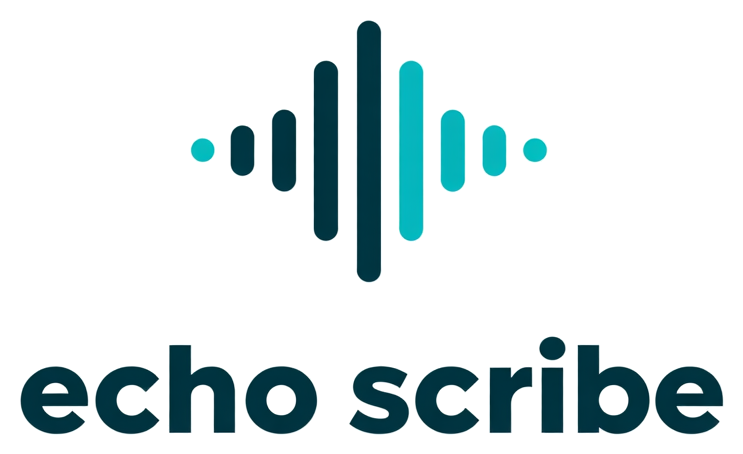
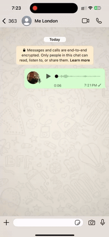
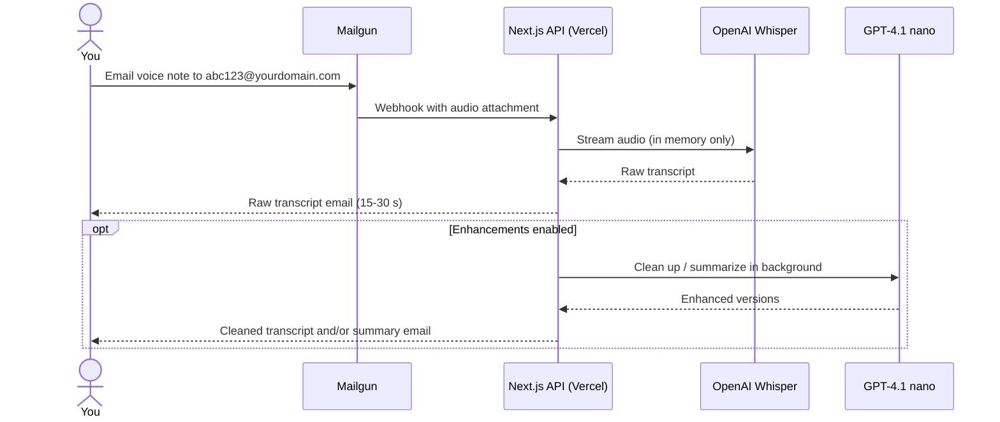
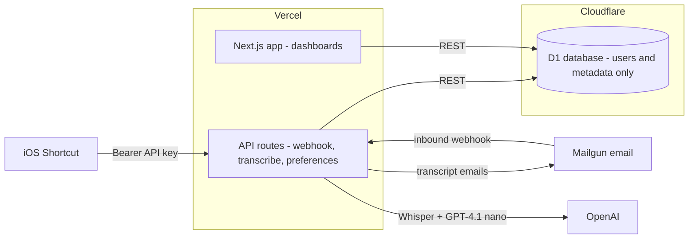

<div align="center">
  

# Echo Scribe

**Turn voice notes into text in seconds — just email the audio.**

[](https://nextjs.org)
[](https://www.typescriptlang.org)
[](https://vercel.com)
[](LICENSE)

</div>

Tired of listening to long voice messages? Echo Scribe converts WhatsApp voice notes (or any audio) into readable text in under a minute. Forward the audio to your personal email address — or tap an iOS Shortcut — and the words come back to you. No apps to install, no uploads, no fuss.



## How it works

1. **Record** a voice note in WhatsApp (or any app)
2. **Email** the audio file to your personal transcription address (`abc123@yourdomain.com`)
3. **Read** the raw transcript 15–30 seconds later — with optional AI-cleaned and summarized versions following right behind



The raw transcript is **always delivered first** — enhancements never make you wait. Each version arrives as a separate, clearly labeled email (`[Raw]`, `[Cleaned]`, `[Summary]`).

## Proven in production

Echo Scribe has been running continuously since **July 2025** and in steady use ever since — hundreds of voice notes and hours of audio transcribed. The production deployment has run for over a year without needing a redeploy, and it costs almost nothing to operate: everything runs on free tiers except OpenAI usage (~$0.006 per minute of audio).

## Features

- **Always raw + optional enhancements** — instant verbatim transcript, plus opt-in grammar cleanup and structured summaries (key points, action items) powered by GPT-4.1 nano
- **iOS Shortcut integration** — every user gets a personal API key; transcribe straight from your iPhone without opening an app
- **Privacy-first** — audio is processed entirely in memory, transcripts are never stored or logged, only metadata is kept
- **User management** — Google sign-in, admin approval workflow, per-user preferences and voice history dashboards
- **Production hardening** — rate limiting, CSRF protection, security headers, Sentry monitoring (content-free), reCAPTCHA on the contact form
- **Wide format support** — M4A, MP3, WAV, OGG, AAC, and FLAC files up to 15 MB / ~25 minutes

## Architecture

A hybrid deployment that leans on each platform's strengths — Vercel for the Next.js app, Cloudflare D1 for the database, accessed over REST:



Voice transcripts never touch the database — they go straight from OpenAI to your inbox. See [ARCHITECTURE.md](ARCHITECTURE.md) for the full system design, data flows, and operational details.

## API & iOS Shortcut

Every approved user gets a permanent API key (managed from the dashboard) for programmatic transcription:

```bash
curl -X POST \
  -H "Authorization: Bearer your-api-key" \
  -F "file=@voice-note.m4a" \
  https://your-domain.vercel.app/api/transcribe
```

```json
{ "text": "Your transcribed voice note content here..." }
```

The dashboard includes a one-click iOS Shortcut download with visual setup instructions — paste your API key once and transcribe from anywhere on your iPhone (see [Credit & Inspiration](#credit--inspiration) for the original concept).

## Run your own

Echo Scribe is designed to run (almost) free: Vercel Hobby + Cloudflare D1 free tier + Mailgun free tier. Only OpenAI usage costs money.

### Prerequisites

- Node.js 18.17+, a [Vercel](https://vercel.com) account, a [Cloudflare](https://cloudflare.com) account (D1), a [Mailgun](https://mailgun.com) account with a verified domain, [Google OAuth credentials](https://console.cloud.google.com/), and an [OpenAI API key](https://platform.openai.com/)

### Quick start

```bash
git clone https://github.com/jchu96/whatsapp-echo.git
cd whatsapp-echo
npm install

# Configure environment
cp env.example .env.local   # then fill in your credentials

# Create and initialize the database
wrangler d1 create voice-transcription-prod
wrangler d1 execute voice-transcription-prod --file=./sql/schema.sql --remote

# Run locally
npm run dev

# Deploy
vercel --prod
```

See [env.example](env.example) for the full list of environment variables, and the [Deployment Guide](docs/DEPLOYMENT.md) for step-by-step service configuration (Mailgun webhooks, OAuth redirect URIs, Vercel settings).

## Privacy & security

The whole system is built around one rule: **your words are never stored.**

- Audio is processed in memory only — never written to disk
- Transcript content is never logged, stored, or sent to monitoring
- The database holds only account info and technical metadata (file size, duration, status)
- Sentry error reports are scrubbed of all content

Security measures include Google OAuth + JWT sessions, per-user rate limiting, CSRF tokens, strict security headers, and SHA256 token auth for background processing. Full details in [SECURITY.md](SECURITY.md).

## Documentation

| Document | What's inside |
| --- | --- |
| [Architecture](ARCHITECTURE.md) | System design, component inventory, data flows |
| [Deployment Guide](docs/DEPLOYMENT.md) | Step-by-step production setup |
| [User Manual](docs/USER_MANUAL.md) | End-user guide from signup to daily use |
| [Security Policy](SECURITY.md) | Security measures, privacy guarantees, vulnerability reporting |
| [Changelog](CHANGELOG.md) | Version history |

## Credit & Inspiration

- **[Nina Patrick (@ninapatrick)](https://github.com/ninapatrick)** — product ideation; helped shape the early concept and direction of Echo Scribe
- **[Giacomo Melzi](https://linkedin.com/in/giacomomelzi)** — original [iOS Shortcut concept](https://giacomomelzi.com/transcribe-audio-messages-iphone-ai) that inspired the API integration; Echo Scribe's version acts as a managed proxy so users never need their own OpenAI account
